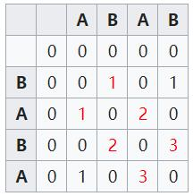

# 5. Longest Palindromic Substring

Given a string s, find the longest palindromic substring in s. You may assume that the maximum length of s is 1000.

Example

    Input: "babad"
    
    Output: "bab"
    
    Note: "aba" is also a valid answer.
    
    Input: "cbbd"

    Output: "bb"


## 概括
    找到字符串中最长回文
    
    
## 解题思想
### 动态规划

DP思想: `动态规划在查找有很多重叠子问题的情况的最优解时有效。它将问题重新组合成子问题。
为了避免多次解决这些子问题，它们的结果都逐渐被计算并被保存，从简单的问题直到整个问题都被解决。`

解决这个问题有两步:
1. 找到原字符串和反转的字符串的[最大相同字符串](https://en.wikipedia.org/wiki/Longest_common_substring_problem).
2. 校验这些字符串是否在对应位置字符串的反转.

####1.最大相同字符串

例如"ABAB" 和 "BABA":
---


令一个2维数组，按照行循环,分别求反转对应位置的字是否相同,如果相同就在之前上一个对角元素的基础上加一(如果是第一次循环,直接赋1),不相同就变0.
最终可以通过最大值所在的行索引,然后行索引减去对于值就可以得到最大相同字段.
####2.校验位置是否合法
对于 `abacdfgdcaba` 和 `abacdgfdcaba` , 最长相同(前后缀)是 `abac` ,但是并不是回文,因为中间断开了.
那么就需要校验位置是否是对应的,所以在每次加入更新最初回文位置时加入如下条件.
>((len-1-i == k-mat\[i]\[k]+1)) 

**注意**: 下标很麻烦,需要尝试.

```java 
class Solution {
    public String longestPalindrome(String s) {
		if (null == s || "".equals(s))
			return "";
		if (s.length() == 1)
			return s;
		if (s.length() == 2) {
			if (s.charAt(0) == s.charAt(1)) {
				return s;
			} else {
				return "" + s.charAt(0);
			}
		}
		StringBuffer r_s = new StringBuffer();
		for(int backward = s.length()-1; backward >= 0; backward-- ){
			r_s.append(s.charAt(backward));
		}
		int[][] mat = new int[s.length()][ s.length()];
		int len = s.length();
		int max = 0 ;
		int i_max = 0;
		for(int i = 0 ; i < len ; i++ ){
			char forwardChar = s.charAt(i);
			for(int k = 0; k < len ; k++ ){
				char backwardChar = r_s.charAt(k);
				if(forwardChar == backwardChar){ 
					if(i== 0 || k==0){
						mat[i][k] = 1 ;
						continue;
					}
					mat[i][k] = mat[i-1][k-1] + 1;
					if(((len-1-i == k-mat[i][k]+1)) && (max < mat[i][k])){
						max = mat[i][k];
						i_max = i ;
					}
				}else{
					mat[i][k] = 0;
				}
			}
		}
		return  s.substring(i_max-max+1, i_max+1) ;
    }
}

```